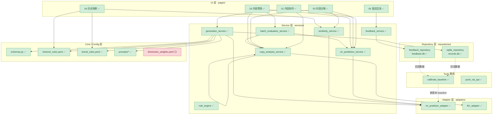

# 项目架构图（截至 2026-08-26 Phase 5 完成）

## 一、总览（5 层架构 + 反哺闭环）

图例：✅ 已完成　⚪ 未启动

---

## 二、模块状态清单

| 层 | 模块 | 状态 | Phase | 备注 |
|---|---|---|---|---|
| **UI** | pages/01_content_studio | ✅ | P3.2 | 三栏主流程，4 渠道预览升级 |
| | pages/02_copy_diagnosis | ✅ | P4 | 五位一体（输入/规则/词语/相似/CTR/AI 改写） |
| | pages/03_batch_evaluation | ✅ | P4 | CSV/Excel 上传 + 评估 + 导出 |
| | pages/04_historical_insights | ✅ | P4 | 七 Tab（rank/词频/emoji/字数/相似/趋势/Owner） |
| | pages/05_feedback | ✅ | P5 | 上传 + 汇总 + join 检查 |
| **Service** | generation_service | ✅ | P3.1 | Demo / LLM 双模式 |
| | copy_analysis_service | ✅ | P3.1 | 规则 + 词语 + CTR 入口 |
| | ctr_prediction_service | ✅ | P3.1 | 走 CTR Adapter |
| | similarity_service | ✅ | P3.1 | 走 find_similar_plans |
| | batch_evaluation_service | ✅ | P4 | CSV/Excel 解析 + 批量评估 |
| | feedback_service | ✅ | P5 | 回流解析 + 列名别名 + 兜底签名 |
| | rule_engine | ✅ | P3.1 | 6 类规则 Pass/Warn/Fail |
| **Repository** | sqlite_repository | ✅ | P3.1 | records.db，自动迁移 |
| | feedback_repository | ✅ | P5 | feedback.db，signature join 锚点 |
| **Adapter** | ctr_predictor_adapter | ✅ | P1 | 隔离 mcd-ctr-predictor |
| | llm_adapter | ✅ | P2 | ProviderRouter 注入 |
| **Core** | schemas.py | ✅ | P3.1 | TaskInput / Candidate / Rule / GenerationRecord |
| | channel_rules.yaml | ✅ | P3.1 | 4 渠道字数上限 |
| | brand_rules.yaml | ✅ | P3.1 | 必带/风险/禁词 |
| | prompts/copy_generation | ✅ | P3.1 | Prompt v1.0 |
| | prompts/copy_rewrite | ✅ | P3.1 | Prompt v1.0 |
| | dimension_weights.yaml | ⚪ | P6 | 维度权重动态 |
| **Tools** | calibrate_baseline | ✅ | P5 | 三段策略校准 + 多版本 |
| | push_via_api | ✅ | P5 | Contents API fallback |

---

## 三、已完成模块数

- ✅ **22 个**（核心功能闭环）
- ⚪ **1 个**（dimension_weights.yaml 待 Phase 6）
- ❌ **0 个**

**端到端闭环已通**：01 创作 → 02 诊断 → 03 批量评估 → 04 历史洞察 → 05 回流 → `tools/calibrate_baseline` → 新 baseline 回灌 01

**未完成闭环**：维度权重动态调整（Phase 6 候选）

---

## 四、Phase 6 候选（docs/feedback-ctr.md §9）

1. P3 维度权重动态（config/dimension_weights.yaml + train_dimension_weights.py）
2. P4 历史洞察签名关联（04 七 Tab 加 signature 视角）
3. 端到端业务闭环串联（自动化跑通 01→05→校准→新 baseline）
4. demo 数据回灌（feedback.db ≥ 50 plan 后，_demo_pred 用本地聚合 CTR 替 2% 假数据）

---

## 五、业务确认结果（PRD §26，2026-08-26 过完）

| # | 项 | 拍板结果 | 落地位置 |
|---|---|---|---|
| 1 | Demo 主渠道 | **APP Push**（第一场） + **企微 1v1**（同期） | `pages/01_content_studio` 渠道预览 |
| 2 | 目标人群枚举 | 复用 copy-analyzer 4 值：新增/流失/活跃/沉默 | `core/schemas.py` TaskInput.audience 注释 |
| 3 | 活动阶段枚举 | 复用 4 值：预热/爆发/长尾/复购 | `core/schemas.py` TaskInput.stage 注释 |
| 4 | 消费场景枚举 | 复用：午间快餐/下午茶/晚正餐/夜宵/外带 | `core/schemas.py` TaskInput.scene 注释 |
| 5 | 渠道字数上限 | 复用 `config/channel_rules.yaml`（APP Push 18/40、企微 15/80、短信 70、站内信 30/100） | `config/channel_rules.yaml` |
| 6 | 品牌词清单 | 复用 必带 5 / 风险 8 / 禁词 12 | `config/brand_rules.yaml` |
| 7 | 维护哪个 predictor | `mcd-ctr-predictor-main`（本地已切这版） | Adapter 内部选择 |
| 8 | CTR 校准状态 | **未校准 / 校准机制已就绪**（baseline.json 写死口径） | 等 P5 数据进入 P2 校准后改 |
| 9 | 置信区间 | **加置信度字段** `confidence = min(0.5 + log10(n+1)*0.15, 0.95)`（PRD v0.2 §5.3 口径 A） | `adapters/ctr_predictor_adapter` |
| 10 | 内网 LLM 接口 | **暂留空**，到时候填 API Provider / Base URL / 模型 / API Key | 新增 `config/llm_settings.yaml`（暂留空） + Settings 页（Phase 6） |
| 11 | 企微 1v1 预览 | **第一场同期做** | Phase 6 P0（本期） |
| 12 | 完整文案存储 | **不存**（records.db 只存 title/body 摘要 + signature + task_json） | `repositories/sqlite_repository` |

**拍板遗留**：等数据进入 P5 回流后，#8 校准状态从"未校准"切到"已校准"，需更新 ctr_baseline.json `version` 字段并对外公告。